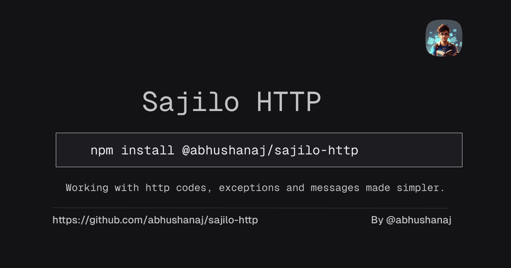

# Sajilo HTTP

Personal npm package designed to provide a comprehensive collection of common HTTP status codes, their corresponding messages, and common exceptions.




## Installation


```bash
npm install sajilo-http
```


## Usage

### Using HTTP Status Codes

1. Using with frameworks like express.js

```ts
import { HTTP_CODES } from '@abhushanaj/sajilo-http';

app.get('/', (req,res)=>{
	return res.status(HTTP_CODES.NOT_FOUND).json({});
})
```

2. Using with Response objects

```ts
import { HTTP_CODES } from '@abhushanaj/sajilo-http';
return new Response({}, {
    status: HTTP_CODES.NOT_FOUND
})
```

### Using the Status Messages

1. Using with frameworks like express.js

```ts
import { STATUS_MESSAGE , HTTP_CODES} from '@abhushanaj/sajilo-http';

app.get('/', (req,res)=>{
	return res.status(HTTP_CODES.NOT_FOUND).json({
		operation: STATUS_MESSAGE.SUCCESS
	});
})
```

2. Using with Response objects

```ts
import { HTTP_CODES } from '@abhushanaj/sajilo-http';
return new Response(
	{
		operation: STATUS_MESSAGE.SUCCESS
	}, 
	{
    status: HTTP_CODES.NOT_FOUND
	})
```

